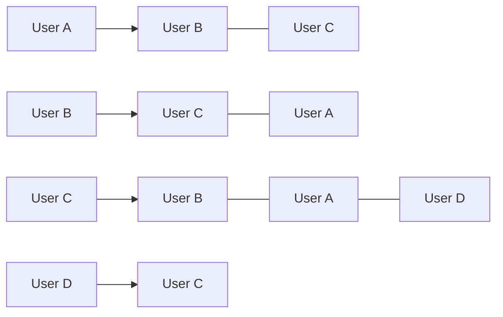

## Q1

5 Points

Grading comment:

Mark Zuckerberg, the CEO of Facebook, has hired you to lead the Facebook Algorithms Group.  He has asked you to use various graph algorithms to analyze the world's largest social network.

The Facebook Graph has 2.8 billion vertices, with each vertex being a Facebook user.  Two vertices are connected provided those two users are "friends".

The first decision you need to make is how you want to model the Facebook graph.

Determine whether you should use an adjacency-list representation or an adjacency-matrix representation.

**Solution 1**

First let us look at the representation of the graph using Adjacency List.

 In an adjacency list, each vertex in the graph is typically associated with a list of its neighboring vertices, or in the case of weighted graphs, it may also store information about the weights of the edges connecting the vertices. In an adjacency list, each vertex is typically represented as a node in a data structure, such as a jagged array, a list, or a dictionary or a combination of array and linked list.

Suppose we have $n=2.3$ billion users in facebook whose node relations need to be mapped. We can represent it as an adjacency list:

Here the first node is the vertices and the linked list out of the array (from A to D) are the edges.

Let's look at the complexity of the adjacency list

**Adding a Vertex**: Adding a vertex to an adjacency list has a constant time complexity, O(1). You simply add an entry for the new vertex in the list.

**Space Complexity**: The space complexity of an adjacency list representation is generally O(V + E), where V is the number of vertices and E is the number of edges in the graph.

Now, let's look at the adjacency matrix.

An adjacency matrix is a data structure used in graph theory to represent a graph as a square matrix. This matrix provides a compact way to represent edges between the vertices of a graph. In an adjacency matrix, rows and columns of the matrix represent vertices, and the entries in the matrix indicate whether there is an edge between the corresponding vertices. 

For representing a facebook user, we would list the users in both the dimensions (row and columns). Hence, the matrix will be $n \times n$ in size. Since a facebook friend is a bidirectional relationship, we will obtain a matrix that is symmetrical on the diagonal.

User 1			User 2			User 3

| 0    | 1    | 0    |
| ---- | ---- | ---- |
| 1    | 0    | 1    |
| 0    | 1    | 0    |

**Space Complexity**: The space complexity of an adjacency matrix is O(V^2), where 'V' is the number of vertices. This means it can be memory-intensive for large graphs, especially when the graph is sparse (has few edges).

**Adding/Removing Vertices**: Adding or removing vertices may require resizing the matrix, which can be an expensive operation, taking O(V^2) time.

Hence, an adjacency list will be better than a matrix for a large $n$ (2.8 billion) to represent friends in facebook.