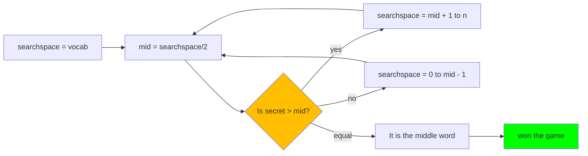
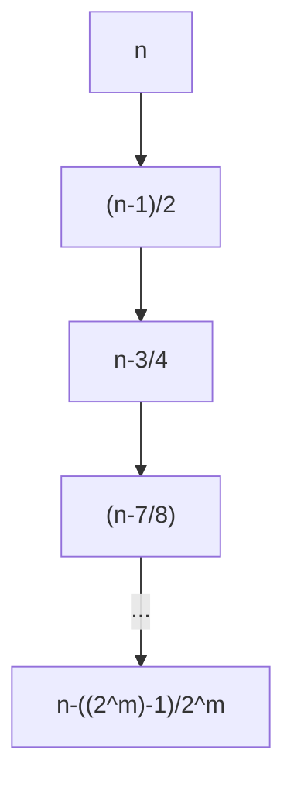
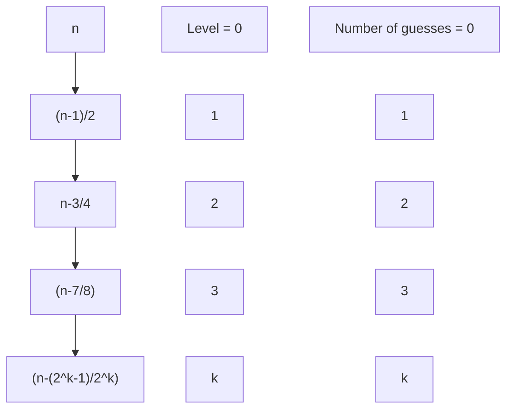

<h1 style="text-align: center"> Synthesis 1 </h1>
<div style="text-align: center"><small>CS 5800</small></div>
<div style="text-align: center"><small>Submitted by : Hardik Bishnoi</small></div>
<div style="text-align: center"><small>NUID : 002807991</small></div>

___

Attempting this was an intriguing but lengthy endeavor. I thank Prof. Mwuara and the Teaching Assistants for taking out time to read and grade it, as well as curating the problems themselves.  The problems you designed have not only strengthened my knowledge but have also inspired me to delve deeper into the subject. Your support and guidance mean a great deal to me, and I am fortunate to have had the opportunity to work on these problems. 

I also thank you for the extra time allotted to me. This aided me greatly.

---

# Problem 1

(1) Of the four options below, exactly one lists the various running times from fastest to slowest. 	

​	A. $O(1), O(n), O(n log n), O(n^2 ), O(2^n ), O(n!), O(n^1000) $

​	B. $O(1), O(n), O(n log n), O(n^2 ), O(n!), O(2^n ), O(n^1000)$ 

​	C. $O(1), O(n), O(n log n), O(n^2 ), O(n^1000), O(n!), O(2^n )$ 

​	D. $O(1), O(n), O(n log n), O(n^2 ), O(n^1000), O(2^n ), O(n!)$ 

Determine which list is correct. Answer either A or B or C or D.

**Solution 1(1):** The correct list is the option **D.** $O(1), O(n), O(n log n), O(n^2 ), O(n^1000), O(2^n ), O(n!)$ 

---

(2) $f(n) = 5n^3 + 10n^2 + 15n + 1000$. 

Consider the following statements: 

i. $f(n) = O(n^1 )$

ii. $f(n) = O(n^2 )$

iii. $f(n) = O(n^3 )$ 

iv. $f(n) = O(n^4 )$ 

Determine how many of these four statements are TRUE.

**Solution 1 (2):** The true statements are (iii) $O(n^3)$ and also (iv) $O(n^4)$.

---

(3) Let $T(n)$ be defined by the recurrence relation $T(1) = 1$, and $T(n) = 32T(n/2) + n^k$ for all $n > 1$. Determine the integer $k$ for which $T(n) = Θ(n^5 log n)$.

**Solution 1 (3):** The value of $k=5$

---

(4) Let $f(n) = 2logn$ and $g(n) = n ^ {\sqrt{n}}$. Determine whether $f(n) = O(g(n))$ or whether $g(n) = O(f(n))$

**Solution 1 (4): ** The answer is $f(n) = O(g(n))$.

---

(5) Let $A$ be an array of numbers. In the maximum sub-array problem, your goal is to determine the sub-array $A[x . . . y]$ of consecutive terms for which the sum of the entries is as large as possible. 

For example, if $A = [−2, −3, 4, −1, −2, 1, 5, −3]$, the maximum sub-array is [4, −1, 2, 1, 5], and the largest possible sum is $S = 4 − 1 − 2 + 1 + 5 = 7$. Suppose $A = [1, 2, −4, 8, 16, −32, 64, 128, −256, 512, 1024, −2048]$.  Determine S, the largest possible sum of a sub-array of A.

**Solution 1(5):** The sum is 1536.

---

(6) Suppose we want to use the Heapsort algorithm to sort a large list of numbers. Our first step is to convert the input list to a heap, and then run BUILD-MAX-HEAP, which applies MAX-HEAPIFY on all the nodes in the heap, starting at the bottom and moving towards the top. 

For example, if $A = [4, 1, 3, 2, 16, 9, 10, 14, 8, 7]$, then BUILD-MAX-HEAP(A) makes a total of 7 swaps, and returns the array [16, 14, 10, 8, 7, 9, 3, 2, 4, 1]. 

The swaps are made in this order: (14, 2),(10, 3),(16, 1),(7, 1),(16, 4),(14, 4),(8, 4). 

Suppose $A = [2, 4, 6, 8, 10, 12, 14, 1, 3, 5, 7, 9, 11, 13, 15]$. 

Determine the total number of swaps made by BUILD-MAX-HEAP(A).

**Solution 1(6):** The total number of swaps made for building the max heap is 8.

---

(7) In class, we spoke about a a Quick Sort Partition Technique introduced by C.A.R Hoare. We referred to this as the ‘Hoare Partition Technique’. This PARTITION(A) procedure inputs an array $A$, and takes the final element $x = A[r]$ as the pivot element. 

The output is an array where all elements to the left of $x$ are less than $x$, and all elements to the right of $x$ are greater than $x$. 

Let $A = [1,2,7,8,9,6,3,4,5]$. Determine PARTITION(A). **You only need to show the first partition.**

**Solution 1(7):** [1,2,4,3,**5**,6,8,7,9] is the partitioned array, with 5 being the pivot element.

---

(8) A binary tree is a tree where each node has at most 2 child nodes. Clearly and carefully give a correct definition for the (a) Height of a node and (b) Depth of a node.

**Solution 1(8):** 

Height of a tree : The height of a node in a tree is the distance (calculated by counting the number of edges) of a given node from the furthest or deepest node.

Depth of a node : The depth of a node is the distance of the given node from the root of the tree.

---

(9) Consider the binary tree given below. Give the output achieved using (a) Preorder Traversal (b) In order Traversal and (c) Post Order Traversal.


**Solution 1(9):** 

The Preorder traversal is : a,b,d,e,c,f,h,l,m,q,i,g,j,n,o,k,p

The Inorder traversal is : d,b,e,a,l,h,q,m,f,i,c,n,j,o,g,k,p

The Postorder traversal is : d,e,b,l,q,m,h,i,f,n,o,j,p,k,c,a

---

(10) A particular balanced binary search tree has the following outputs from tree traversals: 

Inorder traversal: A, B, C, D, E, F, G, H, I, J 

Post Order Traversal: B, A, D, C, G, F, I, J, H, E 

Determine and provide the original balanced binary search tree that gave these outputs.

**Solution 1(10):** 


# Problem 2

(a) Post a screenshot of you winning this game. You receive full credit if you require at most 20 guesses or guess the word within 2 minutes. If you require more than 20 guesses and require more than 2 minutes, you will receive partial credit. (You can play this game as often as you’d like! Please submit a screenshot of your best result.)

**Solution 2(a)**

This is a screenshot of my best run yet. The secret word was 'quiet'.


---

**(b) Suppose the secret word is randomly chosen from a dictionary with exactly 2^k^ − 1 words, where k is a positive integer. Describe an algorithm that guarantees that you can identify the secret word in at most k guesses. Clearly justify how and why your algorithm works.**


**<u>Solution 2(b)</u>**

Before we devise an algorithm, let's first discuss what information we have below:

- We know that the dictionary of the program will have $n = 2^k-1$ words, where $k$ is an integer, $k>0$. If $k=4$, we have 15 words. If $k=10$, we will have 1023 words. This means we will always have an odd number of words in the dictionary. We can rewrite it as:
  $$
  n = 2^k-1\\
  logn = k
  $$
  Which means that the algorithm must always be 

- Let's assume $g$ = number of guesses we need to reliably find the given word. According to the conditions, at any point, $g\le k$. 

- When we play the game, all the words that are not in the dictionary are invalid guesses. Hence, any invalid word will not count as a guess, and hence not count as an operation. <u>Hence, we can also assume that the set of our vocabulary must be the exact same as the set of words in the dictionary.</u> This will prevent us from making any invalid guesses. To make this simpler, <u>let's arrange our vocabulary alphabetically as well</u> - which will make our vocabulary a copy of the dictionary ; i.e. ; if the program has 15 words in it, we also have the list of those 15 words alphabetically arranged, but we do not know the secret word. We can do this since there is no limitation on the on the work that we can do to arrange the list of words that we know, *we only need to optimize the number of guesses*.

Now, let us discuss the *naive strategy* or the brute force method. In the *naive strategy*, as one may expect, we can brute force through the array by iterating through our vocabulary. However, this fails quickly if the position of the word alphabetically in the dictionary is greater than $k$. 

Hence, a more sound strategy must know the approximate location of the word, or shorten the range in which we search for the secret word. This means reliably finding out if the secret word lies towards the end of the dictionary or the start - <u>which can be achieved by using a divide and conquer strategy</u>. 

To implement this, we guess the middle word in our vocabulary. If the word lies after the middle word we guessed, we discard the words from the start of the dictionary till the middle word as being the right word. If it is before the middle word we guessed, we discard all the words after the middle word till the last word in the dictionary. Now, we must keep doing this till we narrow down our search window to the secret element itself.

We can represent the algorithm through the following flowchart:





At the start of the algorithm, our search space starts out as the size of our ordered vocabulary, i.e. of size $n$. In the next iteration, it is cut to $\frac{n-1}2$ elements.

In this algorithm, we make 1 guess every iteration, which is the midpoint. To find out the total  number of guesses made by such an algorithm, we must find out the number of iterations that the program must run for. This can be done by visualizing a worst case scenario where the element we are looking for is at one of the extremes of the search space.

We can visualize this using a recurrence graph for the search space, which starts out at n and ends at $2^m$ at the $m^{th}$ level. 



Since at the end we are left with a singular element which is the answer (after which we require one last guess), we can write our base  case as: 
$$
\frac{n-(2^m-1)}{2^m} = 1\\
\frac{n-2^m+1}{2^m} = 1\\
n+1 = 2^m+2^m \\
log(n+1) = m+1\\
m = log(n+1)-1
$$
Again, since there are $m$ levels to the worst case recurrence tree, there must be at most $m+1 $number of guesses as well since at one element left you require one last search, since each iteration has 1 search. Hence, the total number of searches $g \le m+1$. 

Now, at the worst case
$$
\because m = log(n+1)-1\\
\Rarr g \le log(n+1)-1+1 = log(n+1)\\
$$
Since $n = 2^k-1$, substituting values in the equation above:
$$
g \le log(2^k-1+1) \Rarr log(2^k)\\
= g\le k
$$
Hence, the number of guesses $g$ will always be at most $k$. Hence, we have satisfied the condition since the algorithm will always work with at most $k$ guesses required to be made. 

**Conclusion:**

Therefore, we have found out an algorithm which guarantees an answer with at most $k$ tries made in a dictionary of $2^k-1$ words. 

___

**(c) Let T(n) be the maximum number of guesses required to correctly identify a secret word that is randomly chosen from a dictionary with exactly n words. Determine a recurrence relation for T(n), explain why the recurrence relation is true, and then apply the Master Theorem to show that T(n) = Θ(log n).**


<u>**Solution 2(c)**</u>

To find an appropriate recurrence equation, we can build a recurrence tree of the equation. But first, let's revisit how our algorithm works:


In the proposed algorithm, we start out with a search space (the possible space that the word can be in the entire dictionary) that equals our vocabulary. To eliminate the consideration of any invalid guesses which are not counted as guesses, we will assume our vocabulary is exactly equal to the dictionary of the program at the start, which is of size $n$. We begin with fetching the mid-point of the vocabulary as the guess. <u>Reporting the mid-point takes $O(1)$ or constant time</u> since we are directly computing this. If the mid point is the answer, we win the game. If the mid point is before the secret word, we make the search space equal to mid-point + 1 till n. If it's after the secret word, we make the search space equal to the first word to the mid point - 1. We then recursively apply this till we find the word.

To find the number of guesses, we must find the number of recursive iterations. For this, let's build a recursion tree.



Here, work done is equal to the number of recursive iterations since work done per iteration is $O(1)$. There are k iterations. Hence, we the search space by half by discarding the other half from the original set which is not needed, such that a set of $n$ becomes a set of $\frac{n-(2^k-1)}{2^k}$ elements with every iteration. 

Let us compute our base case. Our base case will happen when there is one element left in the search set. When this happens, we must make one last guess on the obvious answer to complete the number of guesses made. We can hence mathematically represent this as :
$$
T(1) = 1
$$
We can see that the recurrence tree is a straight branch and does not split, hence the branching factor $a$ is 1.


From our previous discussion, we can formulate the equation as :
$$
T(n) = 1*T(\frac{n-1}{2}) + O(1)
$$
Where 1 is the branching factor, $\frac{(n-1)}{2}$ is how much each time the set is divided, and $O(1)$ is the cost to find the middle element. 


Now that we have our equation, let us apply master's theorem on the equation:
$$
T(n) = 1*T(\frac{n-1}{2}) + O(1)
$$
To apply master's theorem, the equation must be of the form :
$$
T(n) = aT(\frac{n}{b}) + f(n), \\ a\ge1, \ b\ge1, f(n)\ge0
$$


Hence, comparing our equation we can determine the values of $a$, $b$ and $f(n)$:
$$
a =1\\
b=2\\
f(n) = O(1)
$$
Now, to proceed with the cases of master's theorem, let's compute $log_ba$:
$$
log_ba = log_21=0
$$
Hence, we can see that, $\because f(n) = O(1)$,

$f(n) = \Theta(n^{log_ba}) = \Theta(1)$


Hence **Case 2** of the master's theorem will apply:
$$
f
(
n
)
=
Θ
(
n^{
log_
b
a}
)
\Rarr
T
(
n
)
=
Θ
(
n^{
log_
b
a}
log
n
)
$$
Which means,
$$
T(n) = \Theta(n^0log_2n) = \Theta(logn)
$$
Hence, by applying master's theorem case 2, we have proved that $T(n) = \Theta(logn)$.

---

(d) Suppose I give you \$15 to play the online Guess My Word game. Every time you make a guess, you give me $1. If you agree to play this game with me, do you expect to win money or lose money? Clearly justify your answer. (Assume that each of the 267,751 words is equally likely to be chosen.)

**Solution 2(d):**

We know the asymptotic complexity of the number of guesses required, which is $O(logn)$. Since here $n=267,751$, on average the number of guesses required will be about $log_2(267751) = 18.035$. Therefore, we would require about 19 guesses (since the number is larger than 18, to be safe) to confirm that we win the game. 

To estimate how much money one can expect to lose or gain through playing the game, one must calculate the odds of winning or losing each guess till the element is finally found.

We can directly tell that if we win on the 19^th^ guess (worst case scenario), we will lose $4 since we will go 4 over 15 guesses. But to assess the overall picture of the stakes, we must calculate the combined probability of winning from the first guess till the 15^th^ guess, right before we start to lose money. 

At each guess, we select the mid point as the guess. So the combined probability is the sum of all  chances of the selected midpoint being the answer till 15 guesses. 

Total probability of winning within 15 guesses = $P(E) = P(1) + P(2) + P(3) + P(4)+..+P(15)$

Now for the first guess, 

Since we know that the probability to choose any element is equally likely as any other
$$
P(1) = \frac{1}{267,751} = 0.00000373481
$$
From 2(b), we know that at every stage after the first one, the search space $n$ becomes $\frac{n-1}2$. 


Likewise, for $n^{th}$ guess till 19:
$$
P(2) = \frac{1}{\frac{n-1}{2}} = \frac{1}{133875} \\
P(3) = \frac{1}{\frac{\frac{n-1}{2}-1}{2}} = \frac{1}{66937}\\
$$
similarly,
$$
P(4) = \frac{1}{33468}\\
P(5) = \frac{1}{16734}\\
P(6) = \frac{1}{8357}\\
P(7) = \frac{1}{4183}\\
P(8) = \frac{1}{2091}\\
P(9) = \frac{1}{1045}\\
P(10) = \frac{1}{522}\\
P(11) = \frac{1}{261}\\
P(12) = \frac{1}{130}\\
P(13) = \frac{1}{65}\\
P(14) = \frac{1}{32}\\
P(15) = \frac{1}{16}\\
$$


Hence, we can now add all these values :
$$
P(E) = \frac{1}{267,751} + \frac{1}{133875} + \frac{1}{66937} + \frac{1}{33468} + \frac{1}{16734} + \frac{1}{8357} + \frac{1}{4183} + \frac{1}{2091} + \frac{1}{1045} + \frac{1}{522} + \frac{1}{261} + \frac{1}{130} + \frac{1}{65} + \frac{1}{32} + \frac{1}{16} \\
$$

$$
P(E)  = 0.1244
$$

Hence the probability of winning within the 15 guess window is quite low at 0.12. If I played this game, I would definitely expect to lose money on average. Although, the probability after 15 guesses immediately starts to raise by a good amount - so if I was offered about \$17-18, this may be a considerable endeavor. We must also note that this is the ideal scenario, and the active vocabulary of a person may be lower than $n$ or may not be a direct overlap, driving the stakes down further. 

---

# Problem 3

(a) $A = [6, 5, 8, 7, 3, 4, 2, 1]$. Perform the Merge Sort algorithm on this array, using a visual illustration of each step to generate the sorted array $[1, 2, 3, 4, 5, 6, 7, 8]$. Show that exactly 12 comparisons are needed to sort this input array $A$.

**Solution 3(a):**

Merge sort is a sorting algorithm that works using divide and conquer. It has a worst case complexity of $O(nlogn)$ making it one of the best sorting algorithms out there. 


Our task is to sort $A = [6, 5, 8, 7, 3, 4, 2, 1]$ through visual representation. 

Below is the required representation:


Hence, as we can see, on the first merge we require 4 comparisons (5<6), (7<8), (3<4), (2<1)

On the second merge we require 4 more comparisons : (5<7), (6<7), (3>2), (3>1)

And finally on the last merge, we require the final 4 comparisons : (5>1), (5>2), (5>3), (5>4)

So the total number of comparisons is 12.

---

(b) Let M(n) be the minimum number of comparisons needed to sort an array A with exactly n elements. For example, $M(1) = 0, M(2) = 1$, and $M(4) = 4$. If $n$ is an even number, clearly explain why $M(n) = 2M(n/2) + n/2$.


**Solution 3(b):**

We're provided with the function $M(n)$ which defines the minimum number of comparisons as a function of $n$ inputs. Our base cases for $M(n)$ are $M(1) = 0, M(2) = 1$, and $M(4) = 4$.

Merge sort performs comparisons when it is merging the array to figure out the position of the respective subarrays and hence the elements. Since after each step each of merging the subarrays the subarrays are sorted, it only needs to compare the lowest element of a subarray with the other elements of the array. So if the lowest element of the subarray is larger than all the elements of the other subarray, then this means there will be no need to compare all the elements of the first subarray with the second subarray. 

For example we have subarrays [5,6,7,8] and [1,2,3,4]. Suppose we wanted to compare these two subarrays, then we would compare the smallest element in the left subarray with all the elements of the right subarray. Since 5 is greater than all the elements of the right subarray, there is no need to compare other elements of the left subarray and the entire left array can be merged to the right of the right subarray resulting in $[1,2,3,4,5,6,7,8]$, a sorted array. 


Hence, we can start formulating the recurrence equation:
$$
M(n) = a*M(\frac{n}2) + \frac{n}2
$$


Since we only need half the comparisons every time, $f(n)$ = $\frac{n}2$, and since each subarray will only split into half of the elements leading to a recursion of $M(\frac{n}2)$ and there will be two of them because during the divide phase (because n is even, the split is cleanly into two equal parts) , we split the initial array into two equal subarrays, and then again recursively keep splitting it. Hence also during the conquer phase (merging), we encounter 2 subarrays every time. This leads to a branching factor of 2.


Hence the equation becomes:
$$
M(n) = 2M(\frac{n}2) + \frac{n}2
$$


We have therefore successfully argued why the minimum number of comparisons required to sort the array $A$ of size $n$ which is even, is expressed by $M(n) = 2M(\frac{n}2) + \frac{n}2$.

---

(c) If n is a power of 2, prove that $M(n) = \frac{n log n}2$ , using any method of your choice. Show all your steps.


**Solution 3(c):** 

I will attempt to prove this through the process of mathematical induction. 

Our claim is that $M(n) = 2M(\frac{n}2) + \frac{n}2 =  \frac{n log n}2$. To prove said claim we need to do the following steps:

- Establish the base case (where the statement holds for k being a small natural number).

- We establish our inductive hypothesis for $n = k$.

- We perform the inductive step and prove that the the claim is true for $n=k+1$.

  

<u>**Step 1:** Base case</u>

$n = 2^k$

Hence, for $k=1$,
$$
M(n) = M(2^1) = 2M(\frac{2}2) + \frac{2}2 = 1\\
$$
and also according to our claim,
$$
M(n) = \frac{nlogn}2 = \frac{2^1log_2^1}2 = \frac{2}2 = 1
$$
Hence our base case stands well.

Now, moving on to our inductive hypothesis:


<u>**Step 2 :** Proposing Inductive Hypothesis</u>

We propose an inductive hypothesis where $M(n) = 2M(\frac{n}2) + \frac{n}2$ equals $\frac{nlogn}2 \forall \ n = 2^k$ where $k$ is a positive integer. 

Hence we also assume, 
$$
M(n) = 2 M(\frac{2^k}2) + \frac{2^k}2
$$
Now we move on to the last step, the mathematical induction.


<u>**Step 3:** Mathematical Induction</u>

We propose that if the hypothesis is to be true, the relation must also be true for $n=2^{k+1}$ where $k$ is a positive integer. 

​	Hence,
$$
M(2^{k+1}) = 2M(\frac{2^{k+1}}2) + \frac{2^{k+1}}2\\
M(2^{k+1}) = 2M(\frac{2*2^k}2) + \frac{2^{k+1}}{2}\\
$$
substituting $2^k$ with our hypothesis we have:
$$
M(2^{k+1}) = 2M(\frac{2^k}2) + \frac{2^{k+1}}{2} \Rarr 2(\frac{2^klog2^k+ 2^{k+1}}2) = \frac{2^{k+1}log(2^{k+1})}2 \\
$$
Hence, through the inductive process we have proved that the hypothesis will hold up for the base case $k=1$, as well as $n = 2^{k+1}$. 

<u>Hence we have proved the hypothesis as well through the process of mathematical induction.</u>

---

(d) Let A be a random permutation of [1, 2, 3, 4, 5, 6, 7, 8]. Determine the probability that exactly 12 comparisons are required by Merge Sort to sort the input array A. Clearly and carefully justify your answer.

**Solution 3(d):**

To make sure that the randomly permutation of the array $A$ as an input will successfully result in a total of 12 comparisons when mergesort is used on it as we saw from 3(a) and (b), we need to make sure that some of the comparisons that take place in merge sort (illustrated in 3(a)) must happen. Hence, assuming we can equally pick any array. we must pick arrays where the 12 comparisons happen: which means certain elements must be adjacent to each other during mergesort happening as it may otherwise add or subtract from 12 comparisons. Hence, 4 and 3 must be adjacent to each other, so must be 5 and 6 and 7 and 8 after the merging process. This will result in the right number of comparisons because in merge sort the lowest element of a subarray is compared with all elements of another array. 

In the end, we also need to preserve the sequence of the final two subarrays [1,2,3,4] and [5,6,7,8] because it will result in a direct, final merged array which is sorted : [1,2,3,4,5,6,7,8].

Hence, $2 * (2!(2!)^2)^2 = 2^7 = 128$

Since there are 8 numbers, there must be 8! ways to arrange those numbers without repeats. 

Our probability can be defined by : $\frac{128}{8!} = \frac{128}{40320} = 0.00317$

Hence the probability of finding a 12 comparison array from randomized permutations of $A$ is very low, about 0.00317.


---

# Problem 4

(a) Let $A = [5, 5, 5, 5, 5, . . . , 5]$ be an array where all of the elements are equal to 5. Determine whether **Selection Sort** or **Insertion Sort** sorts this array faster.

**Solution 4(a):** 

We're given the array $A = [5, 5, 5, 5, 5, . . . , 5]$ to sort. Our objective is to find which amongst selection and insertion sort is faster.

Before we compare the two algorithms, we must first understand how they intricately handle different inputs. To do this, let's first consider the code for selection sort. I will be using python as my preferred language.


**Selection Sort:**

```python
def selection_sort(arr):
    n = len(arr)
    
    for i in range(n):
        min_index = i
        for j in range(i + 1, n):
            if arr[j] < arr[min_index]:
                min_index = j

        arr[i], arr[min_index] = arr[min_index], arr[i]

a = [5,5,5,5,5,5,5,5,5,5]
selection_sort(a)
print(my_list)
```

In the presented code, the iterator $i$ passes through a combined $n=10$ element "5"s in the first iteration. Then, iterator $j$ passes through 9 elements in the second iteration, and so on till both $i$ and $j$ cannot traverse anymore. We can calculate the number of traversals T(n) for an array [5,5,5,5,5,..5] of $n$ size and hence the complexity:


$$
T(n) = n+n-1+n-2+n-3+...+1
= \frac{n(n+1)}2 = \frac{n^2+n}2\\
T(n) = O(n^2)
$$
Now we know that selection sort will take $O(n^2)$ to sort the array. In fact, selection sort will always take $O(n^2)$ time since it is independent of the configuration of the array and simply brute forces the sorting.


Now, let's look at the code for insertion sort.

**Insertion Sort**

```python
def insertion_sort(arr):
    for i in range(1, len(arr)):
        
        current_element = arr[i]               
        j = i - 1
        while j >= 0 and current_element < arr[j]:
            arr[j + 1] = arr[j]
            j -= 1
        
        arr[j + 1] = current_element

# Example usage:
my_list = [5,5,5,5,5,5,5,5,5,5]
insertion_sort(my_list)
print(my_list)

```

In the above code, in order to place the current element in the proper location, the algorithm begins with the second element and compares it to the items in the sorted subarray of the list, moving elements as necessary. A sorted list is produced by repeating this method for every entry in the list. Since the elements are always equal, there will always be only $n$ comparisons before insertion. Hence, the complexity of insertion sort in this scenario must be $O(n)$ since comparisons take most of the work. 

Through the presented argument we now know that selection sort will take quadratic time and insertion sort will take linear time on the given input. Since $O(n)<O(n^2)$, insertion sort will sort the array $ A = [5, 5, 5, 5, 5, . . . , 5]$ faster.

---

(b) Let $A = [n, n − 1, n − 2, . . . , 3, 2, 1]$ be an array where the first n positive integers are listed in decreasing order. Determine whether Heapsort or Quicksort sorts this array faster. For this question, assume the Quicksort pivot is always the right-most element.

**Solution 4(b):** We have been given an array $A = [n, n − 1, n − 2, . . . , 3, 2, 1]$. This array is an array sorted in descending order since the largest element, $n$ is the first element, and all the elements decrease from then on till 1. 

Let's first look at quicksort's code to identify how said algorithm will operate on such an array:

```python
def partition(array, low, high):
    pivot = array[high]
 
    i = low - 1
 
    for j in range(low, high):
        if array[j] <= pivot:
            i = i + 1
            (array[i], array[j]) = (array[j], array[i])
    (array[i + 1], array[high]) = (array[high], array[i + 1])
 
    return i + 1
 
 
def quicksort(array, low, high):
    if low < high:
 
        pivot = partition(array, low, high)
 
        quicksort(array, low, pivot - 1)
 
        quicksort(array, pivot + 1, high)
```

Quicksort sorts the array by partitioning the array using `partition()` into two subarrays around a pivot which is chosen as the rightmost element. The left subarray is containing elements that are smaller than the pivot and the right subarray has elements that are larger than the pivot. The position of the pivot amongst the arrays after each partition is its final position in the sorted array as well. The efficiency of quicksort depends on how balanced the two subarrays or partitions created are in length. For an ideal parse, they should be the same size. 

However, in the case of input $A$, we observe that 1 is our pivot element since it is the rightmost element and is also the smallest, it will be compared and swapped by every other element or $n-1$ number of elements till it moves completely to the left. This will happen for each element till $n$.

We can represent the number of swaps as:
$$
n-1 + n-2+n-3+..+1 = \frac{n(n+1)}{2} = \frac{n^2 + n}2
$$
Since this is $O(n^2)$, quicksort is also $O(n^2)$ for this particular array.

Now, let's move on to heapsort.

```python
def heapify(arr, n, i):
    largest = i
    left_child = 2 * i + 1
    right_child = 2 * i + 2

    if left_child < n and arr[left_child] > arr[largest]:
        largest = left_child

    if right_child < n and arr[right_child] > arr[largest]:
        largest = right_child

    if largest != i:
        arr[i], arr[largest] = arr[largest], arr[i]
        heapify(arr, n, largest)

def heap_sort(arr):
    n = len(arr)

    for i in range(n // 2 - 1, -1, -1):
        heapify(arr, n, i)

    for i in range(n - 1, 0, -1):
        arr[i], arr[0] = arr[0], arr[i]
        heapify(arr, i, 0)
```


Heapsort consists of a `heapify()` function which builds a max-heap from the input array. After the max heap is constructed the algorithm will repeatedly extract the maximum element, which is the root element from the max heap to the end of the array. In the end of the step we also call `heapify()` again to restore the max heap property. Regardless of how the elements are arranged the initial heapification will always take $O(n)$ time. The extraction and heap restoration takes $O(logn)$ and combined over $n$, it takes $O(nlogn)$ time. Hence heapsort runs in $O(nlogn)$ time.

Since $O(nlogn)<O(n^2)$, heapsort will sort the array faster than quicksort will.

---

(c) Let A be an array, where each of the n elements is a randomly chosen integer between 1 and n. For example, if $n = 12$, this array could be $A = [3, 5, 1, 10, 5, 7, 9, 12, 2, 8, 8, 6]$. Determine whether Bubble Sort or Bucket Sort sorts this array faster.

**Solution 4(c):** 

Let us analyze the input array $A$ before we analyze the algorithms. We know that the input array $A$ has a fixed number of elements $n$ with all the elements from 1 to $n$ on initialization but an unfixed order of them. This means there is no inherent increasing/decreasing nature to the elements since they are randomly placed : as in the array $A$ has its elements in random distribution. For instance a randomly generated array over a large enough sample space must follow a uniform distribution: i.e. an element has an equal chance of being bigger or smaller than the next element. 

We can see that if we generate such arrays using a [random number website](random.org).


Now, let's look at the pseudocode for bubblesort:

```
bubbleSort(arr: List of comparable items)
    n = length(arr)
    swapped = true
    while swapped:
        swapped = false
        for i from 1 to n-1:
            if arr[i-1] > arr[i]:
                swap(arr[i-1], arr[i])
                swapped = true
        n = n - 1  

end

```

Bubble sort is a basic sorting technique which compares adjacent elements pairs, with an iterator moving across the array (in this case from n to 1, so backwards) and if the next element in the iteration is larger than the previous element, they are swapped In a perfectly random distribution, such swaps will occur half the time since the probability of the next element in the iteration being bigger than the previous is $\frac{1}2$. In a random array there will be $^nC_2 = \frac{n(n-1)}2$ pairs. This would cause a high amount of swaps leading to a probable $\frac{1}{2} * \frac{n(n-1)}{2} = \frac{n^2 - n}{4}$ swaps, which is $O(n^2)$. Hence, bubble sort is running in $O(n^2)$ on this input array. 

Let's now look at bucketsort's pseudocode:

```pseudocode
procedure bucketSort(arr: List of comparable items)
    n = length(arr)
    max_val = maximum value in arr
    min_val = minimum value in arr
    bucket_count = number of buckets
    buckets = array of empty lists
    range = (max_val - min_val) / bucket_count

    for each item in arr:
        index = (item - min_val) / range
        append item to buckets[index]

    for each bucket in buckets:
        if not isEmpty(bucket):
            sort(bucket)

    sorted_arr = []
    for each bucket in buckets:
        if not isEmpty(bucket):
            append contents of bucket to sorted_arr

    return sorted_arr
end procedure

```

Bucket sort operates by putting the elements in the array into individual buckets and then sorting those buckets. Bucket sort operates well when the array has a uniform distribution because it leads to each bucket containing a uniform number of elements. Distributing the elements into the buckets takes $O(n)$ time. If the buckets are small and uniformly distributed, sorting them takes close to linear time as well. Concatenating $m$ buckets takes $O(m)$ time. Hence,  the performance is of $O(m+n)$ which is linear time. <u>Note that this will only work when on average the randomized array has a uniform distribution, but if it happens to have a skewed distribution, bucket sort will also be $O(n^2)$.</u>

Bucket sort performs better than bubble sort with a randomized array because linear time is faster than quadratic time. 

---

(d) Let A be an array, where each of the n elements is a randomly chosen digit between 0 and 9. For example, if n = 12, this array could be $A = [3, 5, 1, 0, 5, 7, 9, 2, 2, 8, 8, 6]$. Determine whether Counting Sort or Merge Sort sorts this array faster.

**Solution 4(d):** Let's analyze the array $A$ first. The array consists of multiple duplicate elements like 5, 2, 8 repeated. The range of the array is 10 (min 0, max 9).

We can now look at counting sort's pseudocode:

```pseudocode
procedure countingSort(arr: List of integers)
    min_val = minimum value in arr
    max_val = maximum value in arr
    count = array of length (max_val - min_val + 1) initialized to 0

    for each item in arr:
        count[item - min_val] = count[item - min_val] + 1

    output_index = 0
    input_index = 0

    while output_index < length(arr):
        if count[input_index] > 0:
            arr[output_index] = input_index + min_val
            count[input_index] = count[input_index] - 1
            output_index = output_index + 1
        else:
            input_index = input_index + 1

end procedure

```

The algorithm works on the basis of counting duplicate elements and storing them inside another array. First, we determine the range of the array and initialize an auxiliary array the size of the range. Then, we count occurrences of various elements by incrementing the count of the element's value in the auxiliary array. Then we modify the count array so that each element stores the sum of its value and the values before it. The counting phase has a complexity of $O(n)$ because you iterate through the entire input array of $n$ elements and count the occurrences of each distinct value. The final phase involves reconstructing the sorted output array. We iterate through the input array of "n" elements and place each element in its correct position based on the count array. This phase also runs in linear time, $O(n)$, as we process each element once. Hence, as long as the range of the array is smaller than the size of the input array, which the current array satisfies. Hence, the overall time complexity of count sort here is $O(n)$.

Now, let's move on to Merge Sort. This is the pseudocode for merge sort:

```pseudocode
procedure mergeSort(arr: List of comparable items)
    if length(arr) <= 1:
        return arr

    mid = length(arr) / 2
    left = subarray of arr from 0 to mid
    right = subarray of arr from mid to end

    left = mergeSort(left)
    right = mergeSort(right)

    return merge(left, right)

procedure merge(left: List of comparable items, right: List of comparable items)
    result = new empty list
    while left is not empty and right is not empty:
        if left[0] <= right[0]:
            append left[0] to result
            remove the first element from left
        else:
            append right[0] to result
            remove the first element from right

    append remaining elements of left to result
    append remaining elements of right to result

    return result
```

Merge Sort is a divide-and-conquer sorting algorithm. `mergeSort()` recursively divides the input array into two halves until each subarray contains only one element which takes $O(logn)$ because it involves $log_2(n)$ divisions. Then, the `merge` procedure combines and sorts these subarrays to produce a sorted result. Since each element is compared once during merging, this phase has a time complexity of $O(n)$ for each level of the recursion. This process is repeated until the entire array is sorted. We two sorted subarrays to create a larger sorted array. Since mergesort performs the merge phase at each level of the recursion and there are $logn$ levels, the total time complexity is $O(nlogn)$. Note that the performance of merge sort is independent of the type of array. 

Hence, count sort is faster in this particular input than merge sort since $O(n)< O(nlogn)$. 

---

# Problem 5

(a) Consider the following undirected binary tree T with 17 vertices.


Starting with the root vertex a, we can use Breadth-First Search (BFS) or Depth-First Search (DFS) to pass through all of the vertices in this tree. 

Whenever we have more than one option, we always pick the vertex that appears earlier in the alphabet. 

For example, from vertex a, we go to b instead of c. 

Clearly explain the difference between Breadth-First Search and Depth-First Search, and determine the order in which the 17 vertices are reached using each algorithm.

**Solution 5(a):**

Both breadth first search or BFS as well as depth first search or DFS are integral algorithms in computer science operated on binary trees and graphs in general. 

**NOTE: I was unable to tabulate this difference in a table due to rendering issues, please consider the untabulated version below, I will attempt to give explanations for both of the algorithms here. **

**Breadth First Search:**

A BFS is an algorithm that explores the "breadth first", because it explores all the neighbors of a node before moving on to the next level of nodes. It starts out from the source node or the root, and then spreads outwards moving in a breadth-wise manner. 

The BFS uses the queue data structure. It begins with initializing a source node by adding the source node to the queue. While the queue is not empty, it will dequeue a node from the front of the queue. This node becomes the current node. Then, we enqueue all unvisited neighbors of the current node into the queue. This means following the queue FIFO order.

A BFS will guarantee that we will find the shortest path in an unweighted graph. In BFS,  we need to store all nodes at a given level in the queue, before moving on to the next level. In graphs with a wide branching factor, this can lead to a significant memory overhead. Hence BFS requires a high amount of memory usage than DFS (discussed below).

Let us now apply BFS on the tree $T$.

First we visit $a$ as the source node. Then we go to the next level.


Next, searching depth first, we search $b$ and $c$:


Then, we go to the next level, through $d,e,f,g$:


Next, we move to the next level again and search through the breadth to find $h,i,j,k$:


Then, we explore the next level with the nodes $l,m,n,o,p$:


And lastly, we explore the last element $q$:


The traversal order is : $a,b,c,d,e,f,g,h,i,j,k,l,m,n,o,p,q$


**Depth First Search:**

The DFS algorithm is a "depth-first" recursive algorithm implemented to explore a graph or tree. The motive of DFS is to explore each branch as deeply as possible before moving on to the next branch.  It starts out from the source root node that is pushed into a stack data structure along with all the elements. When the stack is not empty we pop an element, which becomes the current node. DFS is guaranteed to visit all nodes. This is because if the stack is empty and not all nodes are visited, it means there might be disconnected components in the graph. In this case, we will select an unvisited node as the new source and continue the DFS traversal from there.

DFS does not guarantee that it will find the shortest path between two nodes in a graph. It might find a path that is longer than the shortest one, depending on the order in which nodes are explored.  DFS uses a stack data structure or recursion for tracking nodes to be explored. In the case of recursion, the call stack of the program is used. Since DFS only maintains the path to the current node and backtracks as soon as possible, it usually requires less memory compared to BFS. In practice, it's especially efficient for deep graphs or graphs with complex structures.

Let us now visualize the depth first search on the graph:

We first see $a,b,d$ along the same branch on the left:


Then we see $e$ on the right side of b as the next branch:


Next, we go down and see $c,f,h,l$ down the branch:


Next, we traverse $m,q$ :


then, $i$ above $m,q$:


after this, we traverse through $g,j,n$:


Then, starting from the right branch of $j$, we traverse $o$:


Then we finally traverse $k$, and then $p$

This leads to the final traversal order to be: $a,b,d,e,c,f,h,l,m,q,i,g,j,n,o,k,p$.

---

(b) Let T be an undirected binary tree with n vertices. Show how you can walk through the tree by crossing each edge of T exactly twice: once in each direction. Clearly explain how your algorithm works, why each edge is guaranteed to be crossed exactly twice, and determine the running time of your algorithm.


**Solution 5(b):**

We know that the depth first search (as the one performed above in 5(a)) must always traverse through each and every edge twice, since it goes all the way down to the leaf and then back to parent. 

Depth first search works through the following steps:

Initialization: DFS starts at the root node of the tree, and it marks this node as visited.

Exploration: DFS recursively explores its left and right children, starting with the left children first. This causes DFS to go through a node once.

Backtracking : When DFS reaches the leaf node, it will backtrack to the parent again to reach the nearest unexplored node. 

We can visualize the algorithm using pseudocode:

```pseudocode
function DFS(node, visited, counter, edgeCount):
    visited[node] = true

    for each neighbor in adjacent_nodes(node):
        if neighbor is not visited:
            counter[node] = counter[node] + 1  
            edgeCount[node, neighbor] = edgeCount[node, neighbor] + 1  

            DFS(neighbor, visited, counter, edgeCount)


Initialize visited[] array to mark nodes as unvisited
Initialize counter[] array to store exploration count for each node
Initialize edgeCount[][] array to store the edge exploration count
Initialize all elements in edgeCount to 0

DFS(start_node, visited, counter, edgeCount)


```


`DFS()` is a recursive function that takes a node, an array `visited` to keep track of visited nodes, an array `counter` to store the exploration count for each node, and a 2D array `edgeCount` to store the exploration count for each edge.

When we traverse an edge from node `node` to its neighbor, we increment the exploration count for both the node and the edge itself. This count represents how many times the DFS algorithm traversed that specific edge during its execution. In the end the number of visits will be equal to two per edge.

Let us take an example through which we may understand why:

Here in our tree, the DFS algorithm explores the left branch till the leaf D after starting from node A. This adds +1 to the counter for each edge.


Next, we backtrack from D to B and then B to A to find any new nodes. This further adds +1 to the edges on the left branch. 


After we reach A, we find that there is an unexplored node C on the right. Then we go to C and the edge gains +1 in counter. 


Next, we go back to A to check for any unexplored nodes. This adds +1 to the edge A-C. There are no such unexplored nodes left, hence the algorithm ends.


Hence, we have visualized DFS, an algorithm which will always go through every edge in a tree twice. 


The running time of the DFS algorithm when applied to a binary tree is $O(V+E)$ considering an adjacency list is used because DFS linearly traverses each element. In the case of a tree, $E$ is always equal to $V - 1$, making the time complexity $O(V)$.

---

(c) Let T be an undirected binary tree. For each pair of vertices, we can compute the distance between these vertices. In the binary tree above, we have dist(d, i) = 5 and dist(l, o) = 6. We define the diameter of T to be the maximum value of dist(x, y), chosen over all pairs of vertices x and y in the tree. Clearly explain why the diameter of the above tree is 7.

**Solution 5(c):**


We can compute the distances of a pair of vertices using $dist(x,y)$. Hence, the longest distances must be the diameter. The diameter can be held by multiple paths.

Let's start considering the depth of various leaves. The diameter has a high possibility of passing through the root, A (but it may not necessarily pass through it).

Hence, lets consider the two subtrees of A. First, we will consider the leftmost branch:


We can see that $dist(a,d)$ is 2. Similarly,


$dist(a,e)$ is also 2.

This covers the left subtree.

Now, we can find multiple paths to the right subtree. We know that q is the deepest leaf in the tree.


We see that q will have the largest depth from A, which is $dist(a,q) = 5$. 

Combined, $dist(d,q) = 7$. 

Now, since l,m,n,o,p are all on the same level of the binary tree, they will have the same distance from $a$ too. 

Hence, let's compute $dist(a,l) = 4$:


Next, we can see that since $i,j,k$ are shallower nodes, they are going to be closer than q to a. Hence their distance from d will be lesser than 7, always.

However, the distance of q to any other node can also be long enough, so now let's check distance of q to other nodes. 

Since n, o, p are on the same level but not in the same subtree (we will not consider l and m since they are on the same subtree as q), they may have a large value of $dist()$.

We can see that dist(q,o) is also 7:


Hence, we have proved that $dist(d,q), dist(e,q), dist(q,o), dist(q,n), dist(q,p)$ are the diameters and there is no other larger distance in the tree other than them. The length of the diameter is 7.

---

(d) Let $T$ be an undirected binary tree with $n$ vertices. Create an algorithm to compute the diameter of $T$. Clearly explain how your algorithm works, why it guarantees the correct output, and determine the running time of your algorithm.

**Solution 5(b):** 

An appropriate way to find the diameter is to use DFS. Using DFS ensures we will explore the tree till the leaf nodes. Every diameter will be connected to the leaf nodes to maximize the length of itself. Hence, all we need to do is which traversals are the longest and add them. The traversals can start from any point.

Here is the pseudocode and then the explanation:

```pseudocode
class TreeNode:
    def __init__(self, val):
        self.val = val
        self.left = None
        self.right = None

def tree_diameter(root):
    def dfs(node):
        nonlocal diameter
        if not node:
            return 0

        left_depth = dfs(node.left)
        right_depth = dfs(node.right)

        diameter = max(diameter, left_depth + right_depth)
        return 1 + max(left_depth, right_depth)

    if not root:
        return 0

    diameter = 0
    dfs(root)
    return diameter
```

First, we initialize a variable named diameter which will update the longest valid path that is found so far. 

Then, we pick any arbitrary node and perform DFS from that node. This ensures we find the furthest node from the starting node (we can perform this DFS since the graph is undirected).

Next, instead of backtracking to the starting node, we choose the furthest node found to be the new starting node and keep recursively applying DFS to the next new starting node. 

When path > diameter, diameter is updated.

The final diameter value will be the one at the end of the algorithm when all the nodes have been visited. 

Now, the algorithm visits each node in the binary tree once during the DFS traversal. This is because it explores every node, traversing all paths in the tree to calculate the depth and update the diameter. If there's $n$ nodes, then this results in $O(n)$ time complexity. Hence the algorithm will run in linear time. 
